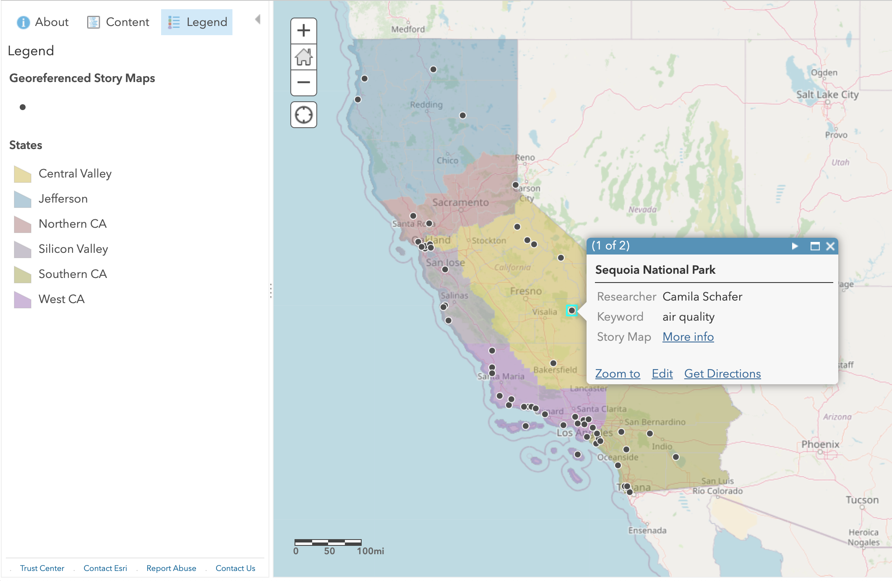

# Geography 148: California (Spring 2018)
Instructor: Sara Lafia, Department of Geography, UC Santa Barbara

## About
The purpose of this course is to introduce the unique landscapes of California and the physical, cultural, and biotic processes that have produced them. Important concepts covered include the location, description, and interplay of California’s cultural and natural resources. Key ideas, such as the influence of physical features upon the economic activities and sequence of California’s occupation, will be presented. Applied assignments and a final project will explore current social and environmental problems, relating them to their geographical roots. This course satisfies a university Writing Requirement.

## Objectives
Upon completion of this course, you will be able to:

* Observe, identify, and articulate basic geographic facts crucial to understanding
and appreciating California's environment
* Analyze and explain physical and cultural phenomena in California based on
geographic principles
* Recognize and define key physical, cultural, and environmental issues
throughout California
* Think like a Geographer by proposing ways of mitigating such issues
* Demonstrate critical thinking, writing, and communication skills

## Readings
[Calendar](./Geog-148-calendar.pdf)

- Walker, R. (2013). The Atlas of California: Mapping the Challenges of a New Era
- McWilliams, C. (1949). California: The great exception. Univ of California 
- Dear, M. (2014). Bajalta California: The border that divides brings us
together. Boom: A Journal of California, 4(1), 86­97. 
- Davis, M. (1995). Hell factories in the field. Nation, 260(7), 229­233.
- Holmes, T. (2013). Farmers Market: Agribusiness and the Agrarian Imaginary in California and the Far West. California History, 90(2), 24­74.
- Starr, K. (2011). A Tale of Two Cities: Los Angeles and San Francisco. In
Coast of Dreams: California on the Edge, 1990­2003. Vintage. 
- Gandy, M. (2006). Riparian anomie: reflections on the Los Angeles River. Landscape Research, 31(2), 135­145.
- North, M. P., Stephens, S. L., Collins, B. M., Agee, J. K., Aplet, G., Franklin, 
- J. F., & Fulé, P. Z. (2015). Reform forest fire management. Science,
349(6254), 1280­1281.
- Pulido, L. (2015). Geographies of race and ethnicity 1: White supremacy vs white privilege in environmental racism research. Progress in Human Geography, 39(6), 809­817.
- Rojas, J. (2003). The enacted environment: Examining the streets and yards
of East Los Angeles. Everyday America: Cultural Landscape Studies After JB Jackson Eds C Wilson, P Groth (University of California Press, Berkeley, CA) pp, 275­292.

## Projects
[Web map of student final projects](https://arcg.is/uefKf)

